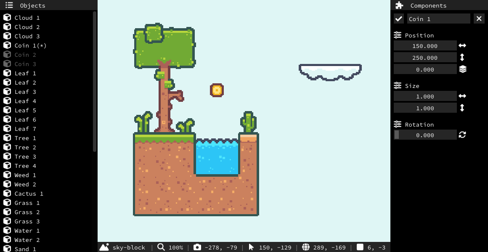

<!-- asagao/README.md -->


# Asagao - 2D Game Engine
###### *Currently being restructured, under development, more features coming soon!*


&nbsp;


---

### Features

- Ruled tilesets
- Animated sprites
- Scene loading

### Usage

```bash
# Navigate to the project root (../asagao)

# Generate project files
$ vendor/premake/premake5 [action]
...

# Compile the project
$ make
...

# Run the executable
$ build/Debug/Asagao
```

Premake documentation for [\[action\]](https://premake.github.io/docs/Using-Premake "How to use Premake")
